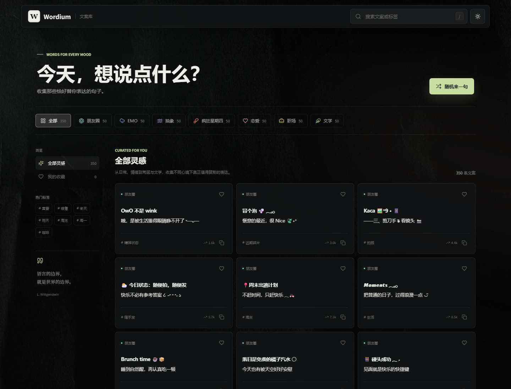
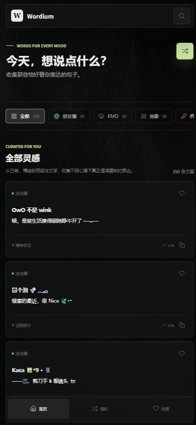

# Wordium 文案库

> 今天，想说点什么？

Wordium 是一个面向日常表达场景的中文文案收藏与检索网站。它把适合朋友圈、情绪表达、恋爱、职场和文学等场景的句子整理成可搜索、可筛选、可收藏、可一键复制的文案库，让用户在需要表达时快速找到恰当的文字。

当前项目内置 **350 条文案**，分为 7 个主题分类，每个分类各 50 条。

## 网站界面

### 桌面端



桌面端默认采用深色主题，以近黑色背景、浅绿色强调色、细边框和轻微玻璃质感构成安静、克制的视觉风格。页面从上到下分为：

- **悬浮顶栏**：左侧是 Wordium 品牌标识，右侧提供文案搜索框、`/` 快捷键提示和明暗主题切换。
- **引导区域**：用“今天，想说点什么？”作为主标题，右侧提供“随机来一句”按钮。
- **分类导航**：以横向标签展示全部、朋友圈、EMO、抽象、疯狂星期四、恋爱、职场和文学，并显示各分类数量。
- **内容区域**：左侧是“全部灵感”“我的收藏”和热门标签，右侧是三列文案卡片流。
- **文案卡片**：展示所属分类、正文、标签、热度、收藏按钮和复制按钮；点击整张卡片也可直接复制。

网站还提供浅色主题。切换后会使用浅灰背景、半透明白色卡片和更深的绿色强调色，布局与功能保持一致。

### 移动端

<p align="center">
  
</p>

移动端会压缩顶栏，将搜索与随机操作收纳为图标按钮；分类栏支持横向滑动，文案卡片在窄屏下变为单列。页面底部固定“首页、随机、收藏”导航，方便单手操作。

## 核心功能

| 功能 | 说明 |
| --- | --- |
| 分类浏览 | 按朋友圈、EMO、抽象、疯狂星期四、恋爱、职场、文学筛选内容 |
| 实时搜索 | 根据文案正文、标签和分类名称即时过滤结果 |
| 热门标签 | 汇总复制热度较高的标签，点击后直接查看相关文案 |
| 一键复制 | 点击卡片或复制图标将正文写入剪贴板，并显示操作提示 |
| 本地收藏 | 收藏结果保存在浏览器 `localStorage` 中，刷新页面后仍然保留 |
| 随机文案 | 从当前筛选结果中随机选择一句，自动定位、高亮并复制 |
| 明暗主题 | 支持深色与浅色主题切换，并记住用户选择 |
| 响应式布局 | 桌面端使用侧栏和多列卡片，移动端使用单列卡片与底部导航 |
| 键盘操作 | `/` 聚焦搜索框，`Esc` 退出搜索，`Enter` 或空格可复制聚焦的卡片 |

## 内容分类

| 分类 | 数量 | 内容特点 |
| --- | ---: | --- |
| 朋友圈 | 50 | 轻松、鲜活、有排版感的生活碎片 |
| EMO | 50 | 关于失去、错过、沉默和遗憾的克制表达 |
| 抽象 | 50 | 通过荒诞、反差和意外制造笑点 |
| 疯狂星期四 | 50 | 长篇铺垫、跨类型叙事和出其不意的结尾 |
| 恋爱 | 50 | 覆盖心动、甜蜜、争吵、异地、和好与遗憾 |
| 职场 | 50 | 用幽默消解会议、加班和人际关系的枯燥 |
| 文学 | 50 | 围绕山水、时序、人间与思考的含蓄表达 |

## 技术实现

- **构建工具**：Vite 6
- **前端技术**：原生 JavaScript、HTML5、CSS3
- **图标库**：Lucide
- **数据存储**：本地 JavaScript 模块提供文案数据，`localStorage` 保存收藏与主题偏好
- **样式特性**：CSS Grid、Flexbox、响应式媒体查询、玻璃模糊、主题变量和减少动态效果适配

项目没有引入前端框架或后端服务，构建产物是纯静态文件，可以部署到 Cloudflare Pages、GitHub Pages、Netlify 等静态托管平台。

## 项目结构

```text
.
├── index.html                  # 页面结构与基础语义
├── package.json                # 项目依赖和脚本
├── public/                     # 公共静态资源
├── src/
│   ├── main.js                 # 渲染、筛选、收藏、复制和主题交互
│   ├── style.css               # 页面视觉、主题与响应式样式
│   ├── content.js              # 分类配置与内容聚合
│   └── content/                # 各分类文案数据
│       ├── moments.js
│       ├── emo.js
│       ├── abstract.js
│       ├── kfc.js
│       ├── love.js
│       ├── work.js
│       └── literary.js
├── docs/images/                # README 界面截图
└── dist/                       # 生产构建产物
```

## 本地运行

请先安装 Node.js 和 pnpm，然后在仓库根目录执行：

```bash
pnpm install
pnpm dev
```

开发服务器启动后，终端会显示本地访问地址。

## 构建与预览

```bash
pnpm build
pnpm preview
```

生产文件会生成到根目录下的 `dist/`。部署静态网站时，将该目录设置为输出目录即可。

## 素材来源

页面背景使用 [Pixelbuddha Studio 的黑色纸张纹理摄影](https://unsplash.com/photos/LHiYkrRC77M)，按 Unsplash License 免费使用。

网站访问：https://lior.cc.cd/